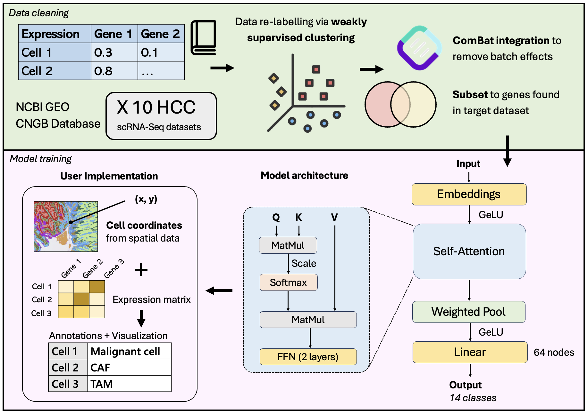

# DeepHepatoScope

## Overview
DeepHepatoScope is a transformer-attention neural network model made for cell type annotation of HD Spatial Transcriptomics data of Hepatocellular Carcinoma.



## Prerequisites
DeepHepatoScope is trained on Python version  `3.12.8`.
We recommend running DeepHepatoScope in a virtual environment.

* Clone this repository:
```
git clone https://github.com/Lionhong-pro/DeepHepatoScope-Supplementary-Data.git
cd DeepHepatoScope-Supplementary-Data
```
* Create and activate a virtual environment:
```
# Linux / macOS
python3 -m venv venv
source venv/bin/activate

# Windows
python -m venv venv
venv\Scripts\activate
```
* Install dependencies:
```
pip install -r requirements.txt
```
* Run the app:
```
python deephepatoscope_app.py
```